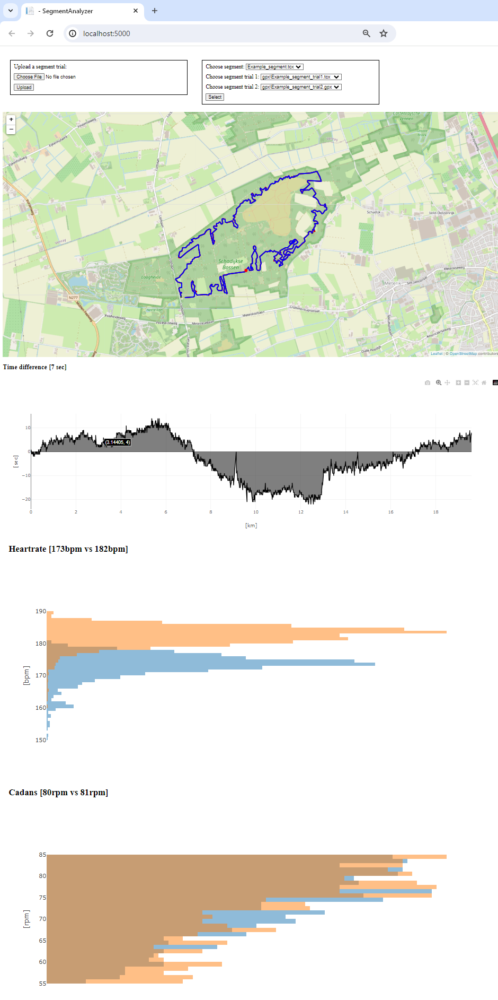

# Segment analyzer

Analyse where on the segment you are losing time.

## Installation

### Docker

* Open command line in root of repository
* docker build . -t segment_analyzer
* docker run -p 5000:5000 segment_analyzer
* http://localhost:5000

### Visual Studio 2022

* Open solution SegmentAnalyzer.sln
* Hit F5 to start build and run application
* http://localhost:5000

### Home Assistant (addon)

* Go to Settings/Add-ons
* Open Add-on Store (left bottom)
* Open Repositories (right top)
* Add: link
* Now Segment Analyzer should pop-up in Add-on Store
* Click Install
* Click Start
* http://[url_home_assistant]:5000